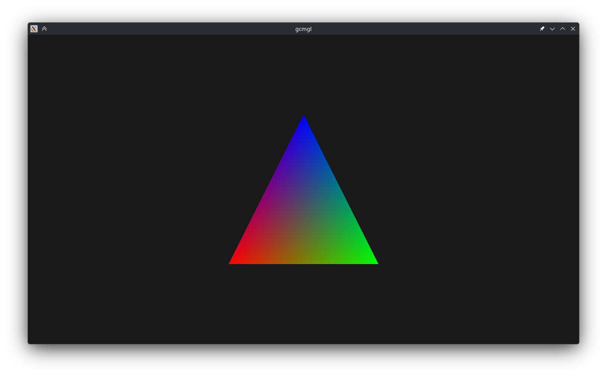
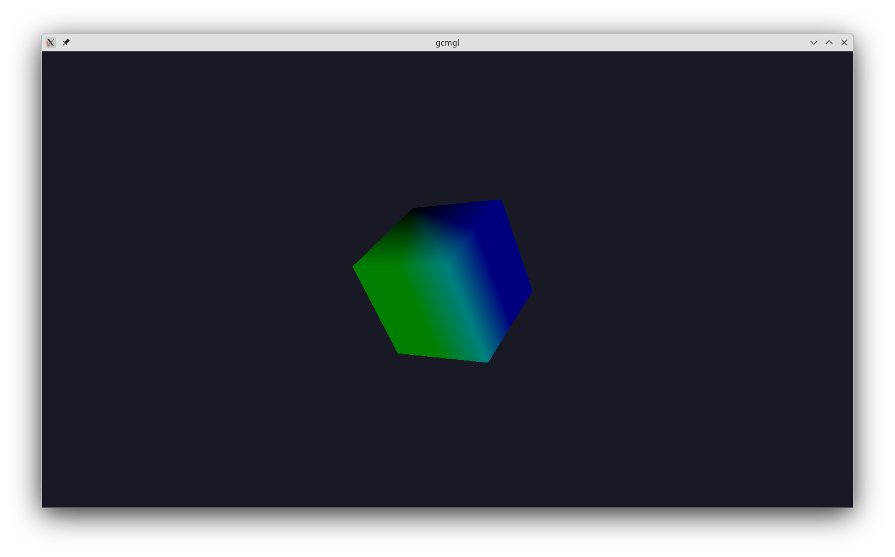
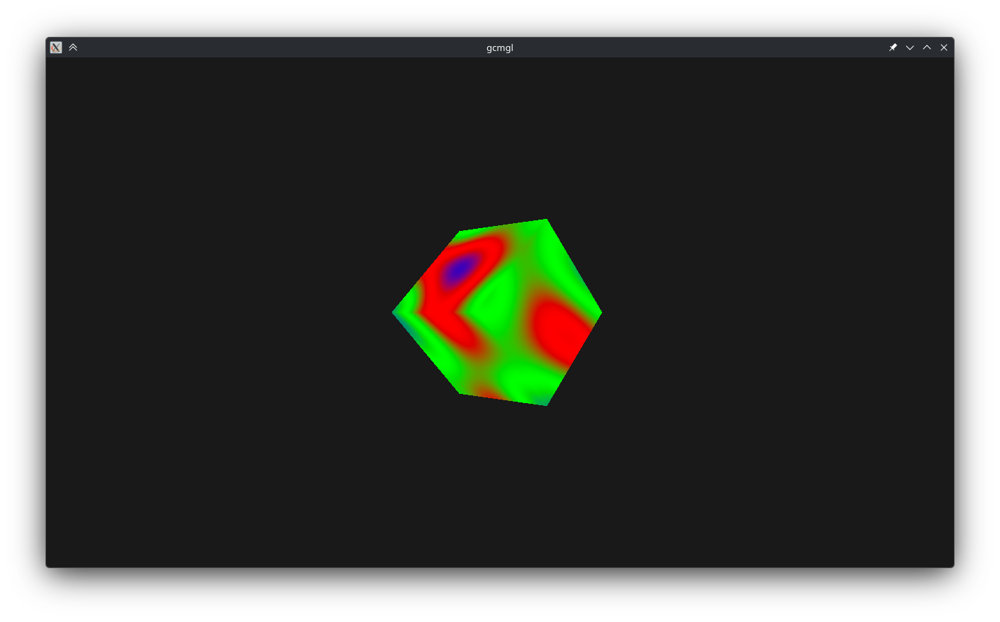
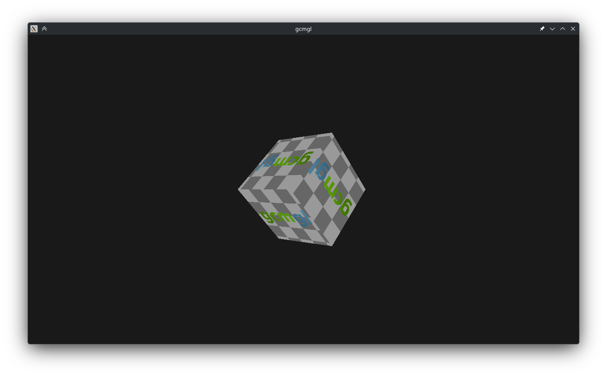
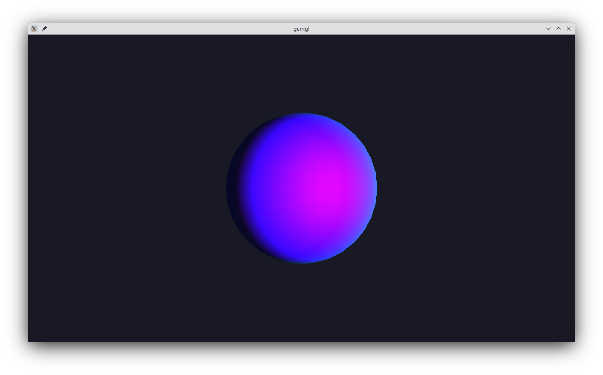
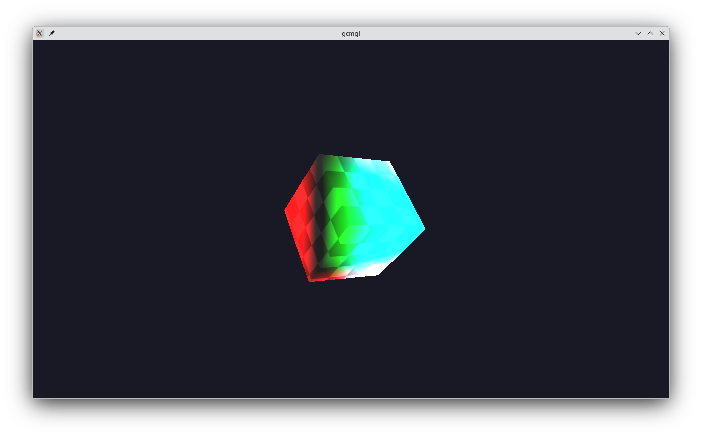
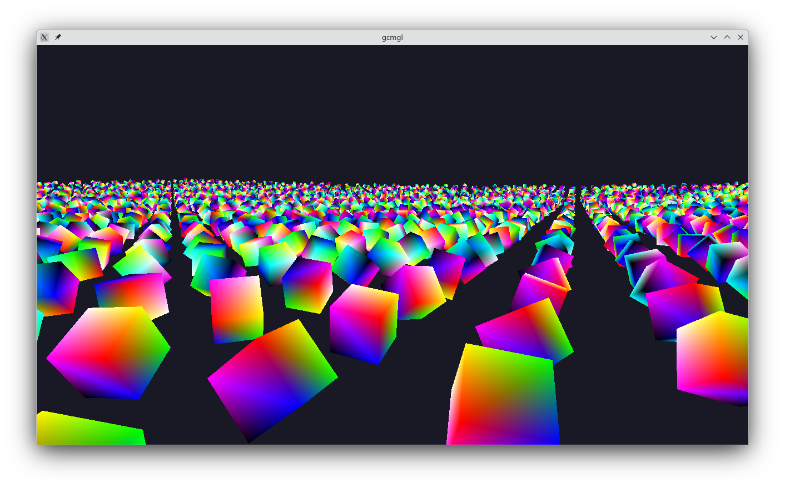

# gcmgl


### A C++ graphics library for PlayStation 3 and Linux.

gcmgl is a C++ graphics library targeting PlayStation 3 (GCM) and Linux (x86_64, OpenGL). gcmgl provides a platform-abstracted renderer interface covering viewports, buffers, shader programs, textures, blend states, draw calls, and batch rendering. Mathematics support is provided by [mathsfury](https://github.com/rs189/mathsfury).

## Requirements

##### Core dependencies:

- [mathsfury](https://github.com/rs189/mathsfury)

##### PS3 build dependencies:

- [ps3toolchain](http://github.com/ps3dev/ps3toolchain)
- [PSL1GHT](http://github.com/ps3dev/PSL1GHT)
- [NVIDIA Cg Toolkit](https://developer.nvidia.com/cg-toolkit-download)
- [ImageMagick](https://imagemagick.org)

##### Linux build dependencies:

- [glad](https://github.com/Dav1dde/glad)
- [SIMDe](https://github.com/simd-everywhere/simde) (optional, for SSE path)

## Interface

### Handles
- `BufferHandle`
- `ShaderProgramHandle`
- `MaterialHandle`
- `TextureHandle`
- `SamplerHandle`
- `RenderTargetHandle`
- `UniformBlockLayoutHandle`

### RendererDesc_t
- `void* m_pWindow`
- `uint32 m_Width`
- `uint32 m_Height`
- `bool m_IsFullscreen`
- `bool m_IsVSync`

### ClearFlags_t
- `ClearNone`
- `ClearColor`
- `ClearDepth`
- `ClearStencil`
- `ClearAll`

### Viewport_t
- `float32 m_X`
- `float32 m_Y`
- `float32 m_Width`
- `float32 m_Height`
- `float32 m_MinDepth`
- `float32 m_MaxDepth`

### Rect_t
- `int32 m_X`
- `int32 m_Y`
- `uint32 m_Width`
- `uint32 m_Height`

### BufferUsage_t
- `Static`
- `Dynamic`
- `Immutable`

### IndexFormat_t
- `UInt16`
- `UInt32`

### TextureFormat_t
- `R8`
- `RG8`
- `RGB8`
- `RGBA8`
- `R16F`
- `RG16F`
- `RGB16F`
- `RGBA16F`
- `R32F`
- `RG32F`
- `RGB32F`
- `RGBA32F`
- `Depth16`
- `Depth24`
- `Depth32F`
- `Depth24Stencil8`

### ShaderStage_t
- `ShaderStageVertex`
- `ShaderStageFragment`
- `ShaderStageAll`

### VertexFormat_t
- `Unspecified`
- `Float`
- `Float2`
- `Float3`
- `Float4`
- `UByte4_Norm`

### VertexSemantic_t
- `Unspecified`
- `Position`
- `Weight`
- `Normal`
- `Color0`
- `Color1`
- `Fog`
- `PointSize`
- `EdgeFlag`
- `TexCoord0`
- `TexCoord1`
- `TexCoord2`
- `TexCoord3`
- `TexCoord4`
- `TexCoord5`
- `TexCoord6`
- `Tangent`
- `TexCoord7`
- `Binormal`

### VertexAttribute_t
- `CFixedString m_Name`
- `VertexFormat_t m_Format`
- `uint32 m_Offset`
- `uint32 m_Location`
- `VertexSemantic_t m_VertexSemantic`

### CVertexLayout
- `void AddAttribute(const CFixedString& name, uint32 format, uint32 offset, uint32 location = 0)`
- `void AddAttribute(const CFixedString& name, uint32 format, uint32 offset, VertexSemantic_t vertexSemantic, uint32 location = 0)`
- `void SetStride(uint32 vertexStride)`
- `uint32 GetStride() const`
- `const CUtlVector<VertexAttribute_t>& GetAttributes() const`

### BlendState_t
- `bool m_IsEnabled`

### DepthStencilState_t
- `bool m_IsDepthTest`
- `bool m_IsDepthWrite`

### PipelineState_t
- `uint64 m_IndexOffset`
- `const CVertexLayout* m_pVertexLayout`
- `ShaderProgramHandle m_hShaderProgram`
- `BufferHandle m_hVertexBuffer`
- `BufferHandle m_hIndexBuffer`
- `uint32 m_VertexStride`
- `uint32 m_VertexOffset`
- `DepthStencilState_t m_DepthStencilState`
- `BlendState_t m_BlendState`

### UniformBlockLayout_t
- `CUtlVector<CFixedString> m_UniformNames`
- `uint32 m_Binding`
- `uint32 m_Size`

### BatchChunkTransform_t
- `CQuaternion m_Rotation`
- `CVector3 m_Position`
- `CVector3 m_Scale`
- `CMatrix4 ToMatrix() const`

### BatchChunk_t
- `CUtlVector<BatchChunkTransform_t> m_BatchChunkTransforms`
- `CVector3 m_Center`

### CBatch
- `CUtlVector<BatchChunk_t> m_BatchChunks`
- `const CVector3* m_pCameraPos`
- `void Add(const CVector3& position, const CQuaternion& rotation = CQuaternion(), const CVector3& scale = CVector3(1.0f, 1.0f, 1.0f))`
- `void Build(float32 chunkSize = 500.0f)`
- `void Clear()`
- `uint32 GetCount() const`

### Plane_t
- `CVector3 m_Normal`
- `float32 m_Distance`

### IRenderer / CRenderer
- `bool Init(const RendererDesc_t& desc)`
- `void Shutdown()`
- `void SetEnvironment()`
- `void BeginFrame()`
- `void EndFrame()`
- `void Clear(uint32 clearFlags, const CColor& color = CColor::Black, float32 depth = 1.0f, uint32 stencil = 0)`
- `void SetViewport(const Viewport_t& viewport)`
- `void SetScissor(const Rect_t& rect)`
- `void SetStencilRef(uint32 stencilRef)`
- `BufferHandle CreateVertexBuffer(const void* pData, uint64 size, BufferUsage_t usage)`
- `BufferHandle CreateIndexBuffer(const void* pData, uint64 size, IndexFormat_t format, BufferUsage_t usage)`
- `BufferHandle CreateConstantBuffer(uint64 size, BufferUsage_t usage)`
- `void UpdateBuffer(BufferHandle hBuffer, const void* pData, uint64 size, uint64 offset = 0)`
- `void DestroyBuffer(BufferHandle hBuffer)`
- `void* MapBuffer(BufferHandle hBuffer)`
- `void UnmapBuffer(BufferHandle hBuffer)`
- `BufferHandle CreateStagingBuffer(uint64 size)`
- `ShaderProgramHandle CreateShaderProgram(const CFixedString& shaderName)`
- `ShaderProgramHandle GetOrCreateShaderProgram(const CFixedString& shaderName)`
- `void DestroyShaderProgram(ShaderProgramHandle hProgram)`
- `void ClearShaderCache()`
- `TextureHandle CreateTexture2D(uint32 width, uint32 height, TextureFormat_t format, const void* pData = GCMGL_NULL)`
- `TextureHandle CreateTextureCube(uint32 size, TextureFormat_t format, const void** ppFaces = GCMGL_NULL)`
- `void SetTexture(TextureHandle hTexture, uint32 slot, ShaderStage_t stage)`
- `void SetSampler(SamplerHandle hSampler, uint32 slot, ShaderStage_t stage)`
- `void UpdateTexture(TextureHandle hTexture, const void* pData, uint32 mipLevel = 0)`
- `void DestroyTexture(TextureHandle hTexture)`
- `void SetShaderProgram(ShaderProgramHandle hProgram)`
- `void SetVertexBuffer(BufferHandle hBuffer, uint32 slot = 0, uint32 vertexStride = 0, uint32 offset = 0, const CVertexLayout* pLayout = GCMGL_NULL)`
- `void SetIndexBuffer(BufferHandle hBuffer, uint64 offset = 0)`
- `UniformBlockLayoutHandle CreateUniformBlockLayout(const UniformBlockLayout_t& layout)`
- `void SetConstantBuffer(BufferHandle hBuffer, UniformBlockLayoutHandle hLayout, uint32 slot, ShaderStage_t stage)`
- `void SetBlendState(const BlendState_t& state)`
- `void SetDepthStencilState(const DepthStencilState_t& state)`
- `void ApplyVertexConstants(ShaderProgramHandle hProgram)`
- `void ApplyFragmentConstants(ShaderProgramHandle hProgram)`
- `void Draw(uint32 vertexCount, uint32 startVertex = 0, const CMatrix4* pViewProjection = GCMGL_NULL, const CVector3* pAABBCenter = GCMGL_NULL, const CVector3* pAABBExtent = GCMGL_NULL)`
- `void DrawIndexed(uint32 indexCount, uint32 startIndex = 0, int32 baseVertex = 0, const CMatrix4* pViewProjection = GCMGL_NULL, const CVector3* pAABBCenter = GCMGL_NULL, const CVector3* pAABBExtent = GCMGL_NULL)`
- `void DrawBatched(uint32 vertexCount, const CBatch& batch, const CMatrix4& viewProjection, uint32 startVertex = 0)`
- `void DrawIndexedBatched(uint32 indexCount, uint32 vertexCount, const CBatch& batch, const CMatrix4& viewProjection, uint32 startIndex = 0, int32 baseVertex = 0)`
- `void SetPipelineState(const PipelineState_t& state)`
- `void FlushPipelineState()`
- `void ExtractFrustumPlanes(const CMatrix4& mvp, Plane_t* pPlanes)`
- `bool TestAABBFrustum(const CVector3& center, const CVector3& extent, const Plane_t* pPlanes)`

### IBatchRenderer / CBatchRenderer
- `void DrawBatched(uint32 vertexCount, const CBatch& batch, const CMatrix4& viewProjection, uint32 startVertex = 0)`
- `void DrawIndexedBatched(uint32 indexCount, uint32 vertexCount, const CBatch& batch, const CMatrix4& viewProjection, uint32 startIndex = 0, int32 baseVertex = 0)`
- `static bool ShouldUpdateChunk(float32 distanceToCamera, uint64 frameCount)`
- `void FrustumCullBatch(const CBatch& batch, const Plane_t* pFrustumPlanes, CUtlVector<BatchChunkTransform_t>& batchChunkTransforms)`
- `static void TransformVertices(char* pDst, uint32 vertexCount, uint32 vertexStride, uint32 vertexPosOffset, const CMatrix4& matrix)`
- `static void ProcessBatch(char* pVertexDst, const char* pVertexSrc, uint32 vertexCount, uint32 vertexStride, uint32 vertexPosOffset, bool hasVertexPos, const CMatrix4& matrix)`
- `static void ProcessIndexedBatch(char* pVertexDst, const char* pVertexSrc, uint32* pIndexDst, const uint32* pIndexSrc, uint32 vertexCount, uint32 indexCount, uint32 batchIndex, uint32 vertexStride, uint32 vertexPosOffset, bool hasVertexPos, const CMatrix4& matrix)`
- `static bool FindVertexPosOffset(const CVertexLayout* pLayout, uint32& outOffset)`

## Build

Install required build dependencies:

- Fedora:
```bash
sudo dnf install cmake gcc-c++ glfw-devel mesa-libGL-devel pkgconf-pkg-config ImageMagick
```

Build using the provided scripts:

- Linux (x86_64):
```bash
./scripts/build_linux_x86_64.sh
```
- PlayStation 3:
```bash
./scripts/build_ps3.sh
```

## Examples

Build scripts prompt for an example to build: `Triangle`, `Cube`, `Shader`, `Textured`, `Lit`, `TexturedLit`, or `Batch`.

- Triangle

- Cube

- Shader

- Textured

- Lit

- TexturedLit

- Batch


## License
gcmgl is licensed under the [MIT License](LICENSE).